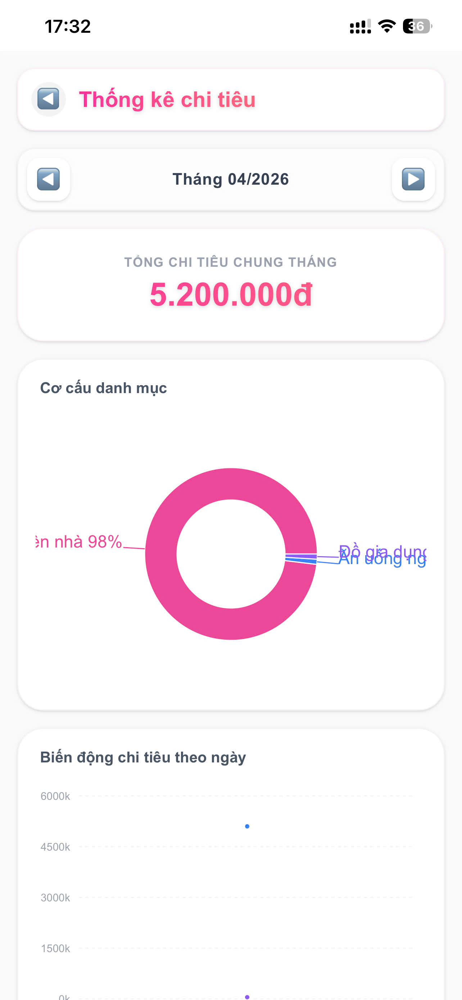
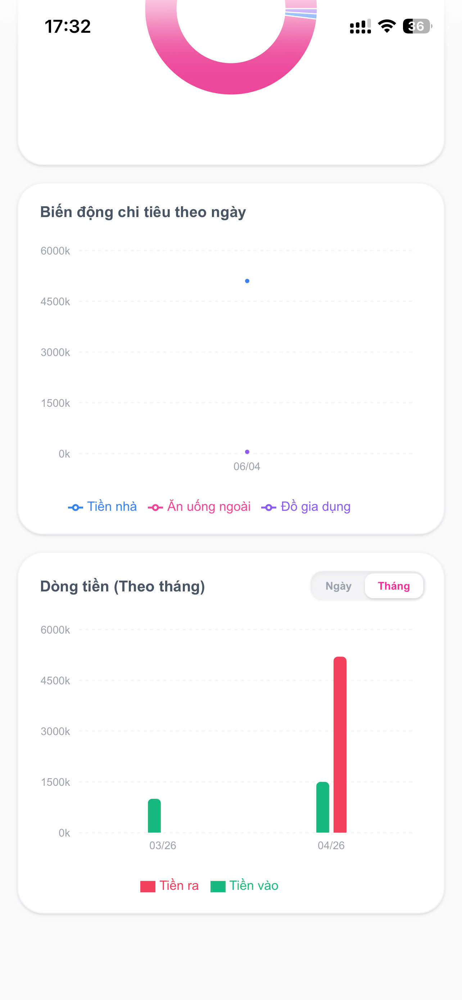

# 💖 CoupleFund - Shared Expense Tracker

**CoupleFund** là một ứng dụng quản lý tài chính thông minh được thiết kế dành riêng cho các cặp đôi. Ứng dụng giúp theo dõi chi tiêu chung, đóng góp vào quỹ và phân tích dòng tiền một cách minh bạch, đẹp mắt và dễ dàng.

---

## 📸 Demo Screenshots

| Trang chủ & Chi tiêu | Đóng góp & Quỹ | Thống kê & Phân tích |
|:---:|:---:|:---:|
 |  |  | 

---

## 🚀 Tính năng nổi bật

- **Quản lý Chi tiêu:** Theo dõi các khoản chi từ quỹ chung hoặc chi cá nhân. Hỗ trợ gắn tag danh mục (Ăn uống, Di chuyển, Shopping, v.v.).
- **Đóng góp quỹ:** Ghi lại các khoản tiền "nạp" vào quỹ chung của hai người.
- **Thống kê chuyên sâu:**
    - **Cơ cấu danh mục:** Biểu đồ Pie trực quan về tỷ lệ chi tiêu.
    - **Biến động chi tiêu:** Biểu đồ Line theo dõi xu hướng chi tiêu theo ngày.
    - **Dòng tiền (Cash Flow):** So sánh Tiền vào vs Tiền ra theo ngày hoặc theo tháng.
- **Chế độ Settle (Thanh toán):** Tính năng chốt sổ nhanh chóng khi cần cân đối lại quỹ.
- **Giao diện tối ưu:** Trải nghiệm mượt mà trên mobile với phong cách thiết kế hiện đại, trẻ trung.

---

## 🛠 Tech Stack

- **Framework:** [Next.js 15+](https://nextjs.org/) (App Router)
- **Language:** [TypeScript](https://www.typescriptlang.org/)
- **Styling:** [Tailwind CSS](https://tailwindcss.com/)
- **Database & Auth:** [Supabase](https://supabase.com/)
- **State Management:** [Zustand](https://zustand-demo.pmnd.rs/)
- **Charts:** [Recharts](https://recharts.org/)
- **Date Handling:** [dayjs](https://day.js.org/)

---

## 🛠 Cài đặt & Khởi chạy

### 1. Clone repository
```bash
git clone https://github.com/bxthien/couple-fund.git
cd couple-fund
```

### 2. Cài đặt dependencies
```bash
yarn install
# hoặc
npm install
```

### 3. Cấu hình biến môi trường
Tạo file `.env.local` và điền các thông tin từ Supabase:
```env
NEXT_PUBLIC_SUPABASE_URL=your_supabase_url
NEXT_PUBLIC_SUPABASE_ANON_KEY=your_supabase_anon_key
```

### 4. Chạy ứng dụng
```bash
yarn dev
```
Mở [http://localhost:3000](http://localhost:3000) trên trình duyệt để trải nghiệm.

---

## 📄 License
Ứng dụng được phát triển bởi [Thiên](https://github.com/bxthien) cho mục đích sử dụng cá nhân và học tập.
